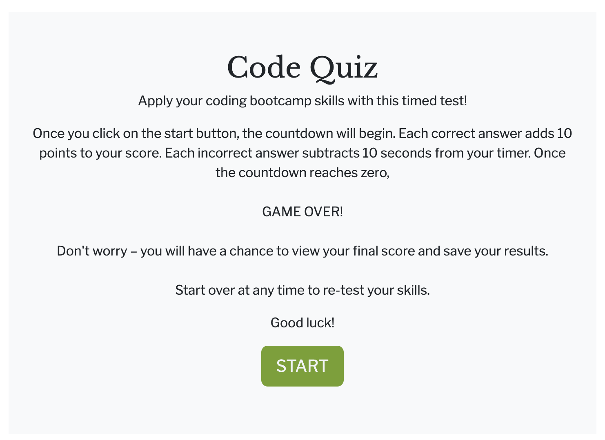
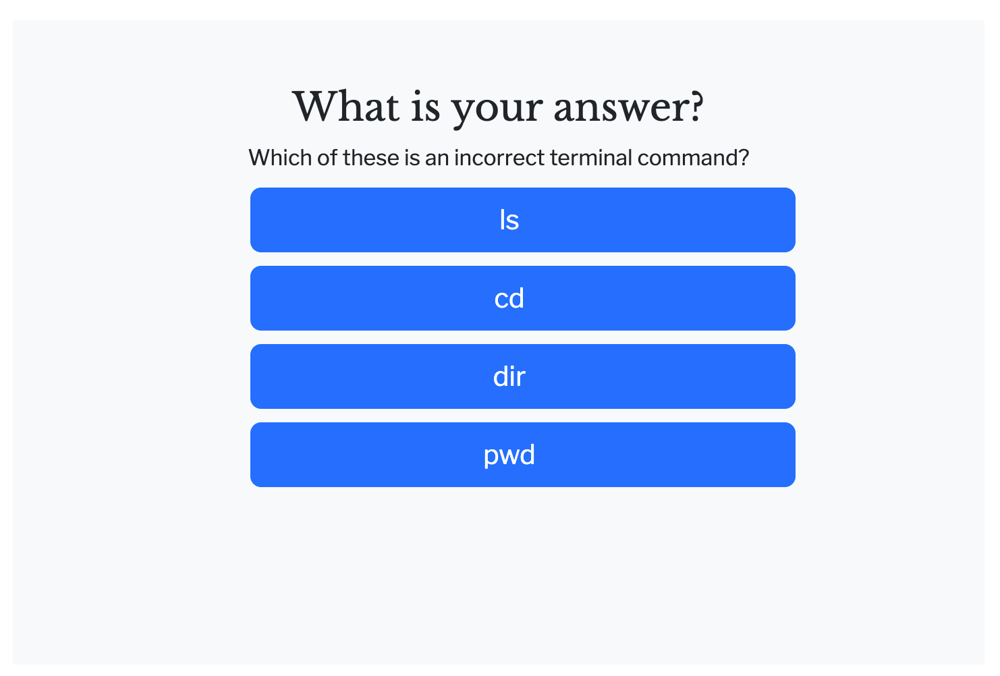

# 04-Challenge-Code-Quiz
An assignment of the ESMT Coding Boot Camp. Apply your skills in CSS, HTML, and Javascript with this timed test.

## Snapshot

## Special challenges
* Setting and logging a three-minute timer
* Showing and hiding sections on a page
* Creating an array of questions and answers
* Selecting and displaying one question with multiple answers
* Dynamically creating id numbers for list elements
* Logging a selected choice
* Identifying correct selection in array
* Index vs natural numbers
* Onclick vs event listener
* Error management with negative values on time or too many questions
## Gratitude
* @vaidehijoshi for "The Final Countdown: Using JavaScript’s setInterval + clearInterval Methods"
* Web Dev Simplified for "Build A Quiz App With JavaScript"
* Sandeep Nayak for the reply to "[Storing quiz questions in array of objects](https://stackoverflow.com/questions/37252041/storing-quiz-questions-in-array-of-objects)" (Stackoverflow)
* Tiffany Conroy for assistance with pulling data from arrays (objects, properties)
* MDN for the example code that helped me with creating id numbers dynamically. Source: "[Element.innerHTML](https://developer.mozilla.org/en-US/docs/Web/API/Element/innerHTML#appending_html_to_an_element)" 
* Nisse Engström and jbrookover for their solution on "[How to pass the id of an element that triggers an `onclick` event to the event handling function](https://stackoverflow.com/questions/6575210/how-to-pass-the-id-of-an-element-that-triggers-an-onclick-event-to-the-event-h)"
* My coding camp study buddies!
## Contact
Tammi L. Coles
URL of deployed application:  https://tlcoles.github.io/04-Challenge-Code-Quiz/  
URL of the GitHub repository: https://github.com/tlcoles/04-Challenge-Code-Quiz  